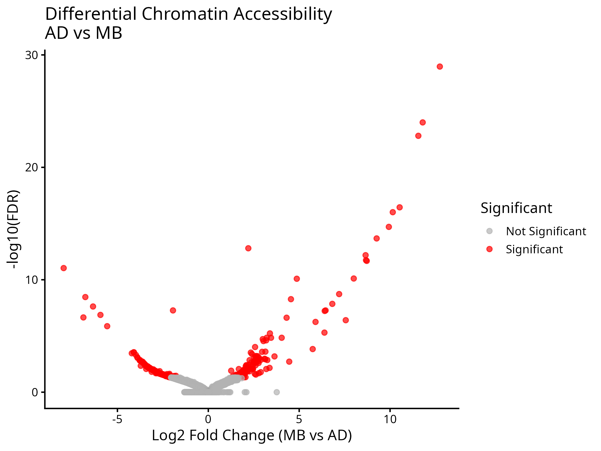
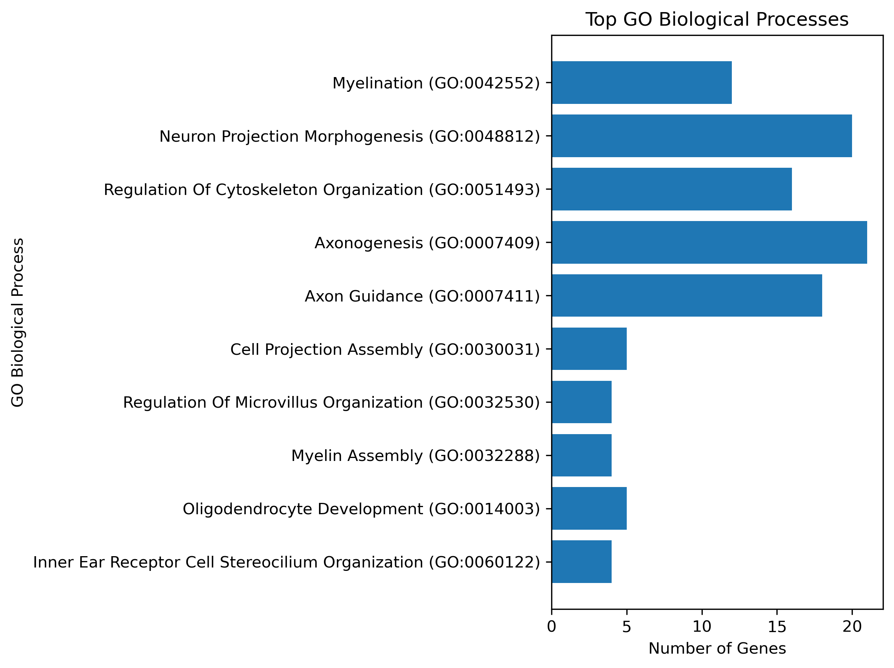
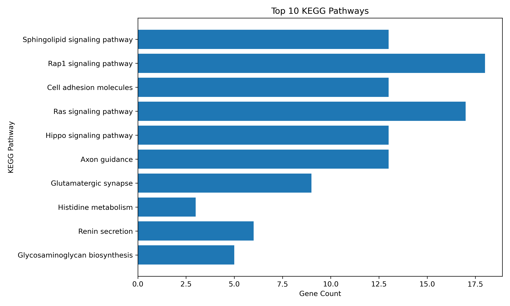

# 🧬 Comparative ATAC-seq Analysis of Alzheimer's Disease and Medulloblastoma Microglia

## Project Overview

This repository contains a comparative ATAC-seq analysis pipeline designed to identify shared chromatin accessibility patterns between **Alzheimer's Disease (AD)** and **Medulloblastoma (MB)** microglia. The workflow integrates quality control, read alignment, peak calling, differential binding analysis, peak annotation, and motif enrichment to investigate common epigenetic regulatory mechanisms.

---

## Objectives

* Perform quality assessment of ATAC-seq sequencing data.
* Align sequencing reads to the human reference genome (GRCh38).
* Process and filter aligned reads.
* Identify accessible chromatin regions using MACS2.
* Perform differential chromatin accessibility analysis using DiffBind and DESeq2.
* Identify shared chromatin regions between AD and MB.
* Annotate genomic regions using HOMER.
* Perform transcription factor motif enrichment analysis.
* Visualize and interpret the biological significance of the results.

---

## Workflow

```text
Raw FASTQ Files
        │
        ▼
Quality Control (FastQC)
        │
        ▼
Read Alignment (BWA)
        │
        ▼
SAM → BAM Conversion
        │
        ▼
Sorting & Indexing (SAMtools)
        │
        ▼
PCR Duplicate Removal
        │
        ▼
Merge Biological Replicates
        │
        ▼
Peak Calling (MACS2)
        │
        ▼
Differential Binding Analysis (DiffBind + DESeq2)
        │
        ▼
Shared Peak Identification (BEDTools)
        │
        ▼
Peak Annotation (HOMER)
        │
        ▼
Motif Enrichment Analysis
        │
        ▼
Promoter Analysis & Visualization
```

---

## Software and Tools

* Ubuntu Linux
* Cell Ranger ATAC
* FastQC
* BWA
* SAMtools
* BEDTools
* MACS2
* HOMER
* R
* DiffBind
* DESeq2
* Python
* Jupyter Notebook

---

## Repository Structure

```text
comparative-atac-seq-analysis/
│
├── comparative_atac_seq_analysis.ipynb      # ATAC-seq preprocessing, peak calling, shared chromatin region analysis, annotation and motif analysis
├── functional_enrichment_analysis.ipynb     # Differential analysis, GO, KEGG, Reactome enrichment, PCA and Volcano plot
├── README.md
├── figures/
├── LICENSE
```
---

## Repository Contents

### 📓 comparative_atac_seq_analysis.ipynb

This notebook contains the complete ATAC-seq analysis workflow, including:

- Downloading sequencing data
- Quality control (FastQC)
- Read alignment (BWA)
- SAM to BAM conversion
- Sorting and indexing BAM files
- PCR duplicate removal
- Peak calling using MACS2
- Shared chromatin region identification
- Peak annotation using HOMER
- Motif enrichment analysis

### 📓 functional_enrichment_analysis.ipynb

This notebook contains the downstream biological analysis, including:

- Differential accessibility analysis using DiffBind and DESeq2
- Gene Ontology (GO) enrichment analysis
- KEGG pathway enrichment
- Reactome pathway enrichment
- Volcano plot visualization
- PCA visualization
- Biological interpretation of differential genes

## Analysis Pipeline

1. Download Cell Ranger ATAC.
2. Download the GRCh38 reference genome.
3. Create working directories.
4. Prepare FASTQ files.
5. Perform FastQC.
6. Align reads using BWA.
7. Convert SAM files to BAM format.
8. Sort and index BAM files.
9. Remove PCR duplicates using SAMtools.
10. Merge AD and MB biological replicates.
11. Sort merged BAM files.
12. Call peaks using MACS2.
13. Perform differential binding analysis using DiffBind and DESeq2.
14. Identify shared peaks using BEDTools.
15. Annotate peaks using HOMER.
16. Perform motif enrichment analysis.
17. Analyze promoter-associated peaks.
18. Generate summary visualizations.

---

## Key Results

### Volcano Plot

Differential accessibility analysis highlighting significantly altered chromatin regions.



---

### Gene Ontology (Biological Process)

Top enriched biological processes identified from differential genes.



---

### KEGG Pathway Enrichment

Significantly enriched KEGG pathways associated with differential genes.



---

### Reactome Pathway Enrichment

Top enriched Reactome pathways associated with differential genes.


---

## Data Availability

The raw sequencing data used in this project are available from the NCBI Sequence Read Archive (SRA). This repository contains the analysis workflow and selected processed results; large raw sequencing files are not included.

---

## Future Improvements

* Functional enrichment analysis (GO/KEGG/Reactome)
* Genome browser (IGV) visualization
* Additional quality control metrics
* Workflow automation using Snakemake or Nextflow

---

## Author

**Ankita Bhosale**

B.Sc. (Hons.) Bioinformatics

---

## License

This project is released under the MIT License.
